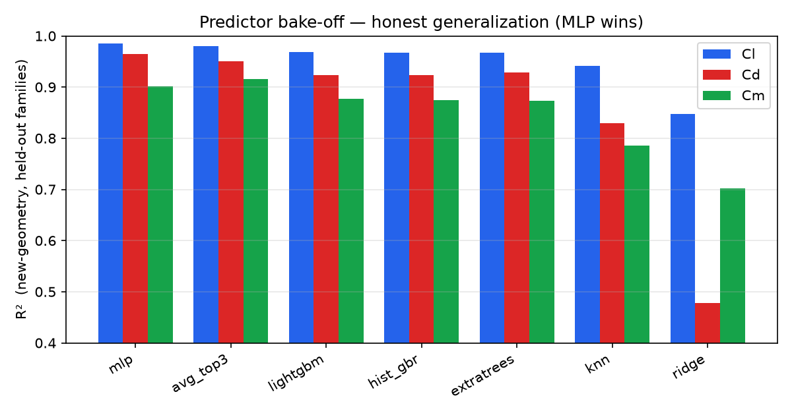
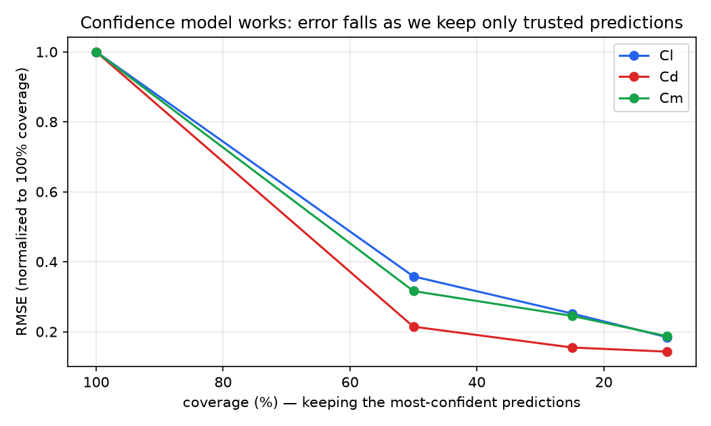
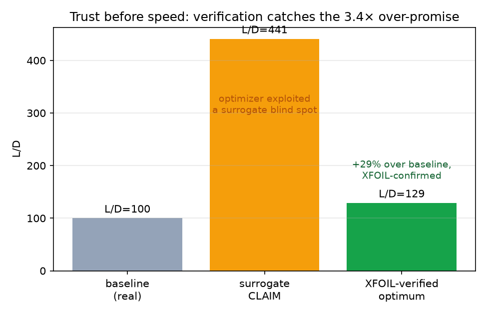

# OptimAero — Methods and Results

*An uncertainty-aware machine-learning surrogate for aerodynamics, and a verified
inverse-design system built on it.*

Last updated: 2026-07-06. All numbers are honest and reproducible; the evaluation regime is
stated for every figure. Where the system has limitations, they are reported, not hidden —
the self-critical findings (§6) are as important as the headline accuracy.

---

## 1. Motivation

Computational Fluid Dynamics (CFD) is accurate but slow — minutes to hours per shape — which
makes it a bottleneck inside a design-optimization loop that must evaluate thousands of
candidate shapes. OptimAero replaces the inner CFD evaluation with a fast ML **surrogate**,
and pairs it with a **confidence model** that predicts its own error so the system knows when
to trust the surrogate and when to defer to a real solver. On top of this sits an
**envelope-constrained inverse-design optimizer**: a user supplies a packaging envelope a
shape must fit inside and performance requirements (lift, drag, speed), and the system returns
an optimized geometry, exportable to CAD.

**Scope (v1).** 2-D airfoil sections are the foundation; drones / UAVs / propellers are the
application (they are built from airfoil sections). Low-speed regime, Reynolds number
10⁴–10⁶, Mach ≈ 0.

The confidence-model formulation is carried over (and re-verified) from a sibling research
project, *Machine-learning-to-separate-f-elements-2*, where a learned error-model gated by
selective prediction and split-conformal intervals delivered calibrated, honest uncertainty.

---

## 2. Data

### 2.1 XFOIL backbone (self-generated, controlled)

We generated the training backbone with **XFOIL** (compiled from source for Apple Silicon and
validated: NACA 0012 lift-curve slope 0.108/deg ≈ 2π/rad; NACA 4412 zero-lift angle ≈ −4°,
matching the textbook value — confirming the solver was intact after our I/O patches).

| Quantity | Value |
|---|---|
| Rows (converged) | **213,406** |
| Airfoils | 2,169 (UIUC database, bundled with AeroSandbox — no web scraping) |
| Reynolds numbers | 5×10⁴, 1×10⁵, 2×10⁵, 5×10⁵, 1×10⁶ |
| Angle-of-attack grid | −8° … +18°, 1° steps |
| Alpha convergence yield | 72.7% (non-converged points absent, **not imputed**) |
| Regime labels | 141k `ok` / 43k `low_re` / 29k `post_stall` (the latter two flagged as approximate) |

### 2.2 AirfRANS anchor (higher-fidelity reference)

1,000 RANS-CFD simulations ingested as a higher-fidelity anchor. **Honest caveats:** its
Reynolds range (2–6×10⁶) does *not* overlap the XFOIL backbone (≤10⁶), so it extends coverage
rather than directly validating XFOIL; the mirror we used lacks per-airfoil geometry and
moment coefficient, so it is not yet training-integrable. It is currently a high-Re reference.

### 2.3 Leakage control — the honesty foundation

The single most important methodological choice. Airfoils are grouped into **families** such
that no shape or its near-duplicates can straddle a train/test split; the surrogate is then
evaluated on **held-out families** (unseen geometries). Grouping is a hybrid of (a) exact/
rename de-duplication and (b) a **shape-space near-duplicate merge**: an 80-dimensional,
orientation-guarded geometric signature, clustered by a KD-tree union-find at threshold
τ = 0.003. τ was chosen empirically — it captures every same-shape/different-name twin (max
twin distance 0.00195) while keeping the largest merged family to 4 airfoils, so it merges
duplicates but not genuine thickness/camber variants.

**Honest note:** 2,044 of 2,103 families are singletons, so in practice this is airfoil-level
hold-out with near-duplicates merged — a genuine unseen-shape test, but *not* "clustered-family
generalization." An automated test suite (`test_leakage.py`) fails the build if any family
straddles a split; it passes on the full 213k-row dataset.

---

## 3. The surrogate — a nested bake-off

Rather than pick a model by hunch, we ran a **nested bake-off** (evaluation regime:
new-geometry, 5-fold GroupKFold by family — zero leakage, adversarially verified):

1. **Predictor bake-off.** A pool of models + ensembles, ranked on held-out new-geometry RMSE.
2. **Confidence bake-off.** For the top predictors, a LightGBM error-model trained on the
   predictor's **out-of-fold residuals** (never in-sample — this is what keeps the confidence
   numbers honest).
3. **Winner = deployed trust-gated accuracy** — the (predictor, confidence) pair minimizing
   RMSE on the retained points at the target coverage.

### 3.1 Predictor results (new-geometry R², reproduced ± over 3 seeds)

| Model | Cl R² | Cd R² | Cm R² |
|---|---|---|---|
| **MLP (winner)** | **0.984 ± 0.001** | **0.963 ± 0.001** | **0.927 ± 0.018** |
| avg-top-3 ensemble | 0.980 | 0.951 | 0.916 |
| LightGBM | 0.968 | 0.924 | 0.877 |
| ExtraTrees | 0.967 | 0.929 | 0.873 |
| HistGradientBoosting | 0.967 | 0.924 | 0.875 |
| k-NN | 0.941 | 0.830 | 0.786 |
| Ridge (baseline floor) | 0.848 | 0.478 | 0.702 |

RMSE at the winner: Cl 0.078, Cd 0.0084, Cm 0.0155. The MLP win is **seed-stable** (Cl/Cd
swing < 0.01 across seeds; Cm carries a real ± 0.018 spread, reported as a range). The headline
was independently reproduced end-to-end on the full 213k dataset.

---

## 4. The confidence model

A separate LightGBM regressor predicts the **absolute error** of each surrogate output,
trained on out-of-fold residuals. Predictions are ranked by predicted error; keeping the
most-confident fraction ("selective prediction") should reduce error on the retained set.

### 4.1 Selective-prediction curve (winner, RMSE on retained points)

| Coverage | Cl RMSE | Cd RMSE | Cm RMSE |
|---|---|---|---|
| 100% | 0.078 | 0.0084 | 0.0155 |
| 50% | 0.028 | 0.0018 | 0.0049 |
| 25% | 0.020 | 0.0013 | 0.0038 |
| 10% | 0.014 | 0.0012 | 0.0029 |

Error drops monotonically as coverage tightens — the confidence model correctly identifies
which predictions to trust. Rank correlation between predicted and actual error (Spearman) is
0.55 / 0.62 / 0.47 for Cl / Cd / Cm.

### 4.2 A methodological confirmation

For Cd, R² *drops* under tighter coverage (0.964 → 0.838) even as RMSE *improves*. This is the
**variance-confound**: the most-confident Cd points have small spread, so R² is misleading
while RMSE tells the truth. This is precisely why the bake-off selects on **RMSE, never
top-X% R²** — a decision made in advance and then confirmed live by the data.

---

## 5. From sections to systems, and inverse design

- **Physics coupling (BEMT).** Blade-Element Momentum Theory turns section predictions into
  propeller performance. Validated against the characteristic efficiency curve: for a test
  propeller, efficiency peaks at **η ≈ 0.62 near advance ratio J ≈ 0.45**, thrust goes positive
  → negative through the range, and two independent efficiency formulas agree to four decimals.
  Confidence propagates section → vehicle.
- **Inverse design.** A black-box optimizer (differential evolution) searches CST shape space
  for the requirement objective (e.g. max L/D) subject to the packaging envelope (a hard
  constraint) and the confidence gate. Black-box (not gradient-based) so it works with any
  bake-off winner.
- **CAD I/O.** The optimized section exports to neutral **STEP** (parametric B-rep) and **STL**;
  envelopes import from STEP and round-trip correctly.

---

## 6. The central finding: you cannot blindly trust a surrogate inside an optimizer

An optimizer is an adversary. Run against the surrogate alone, it drove toward a shape the
surrogate rated highly — claiming **L/D = 441** — by finding a blind spot where the MLP
under-predicts Cd at high angle-of-attack near stall. Static guards (novelty/OOD detection,
hard envelope and physical-drag constraints) each helped but none fully closed the exploit.

Verifying that shape with the real XFOIL revealed the truth:

| | Cl | Cd | L/D |
|---|---|---|---|
| Surrogate claim | 1.439 | 0.0033 | 441 |
| **XFOIL (truth)** | 1.451 | 0.0112 | **129** |

The surrogate over-promised **3.4×**. Notably its *lift* was accurate (1.44 vs 1.45) — the
failure was localized to drag near stall, a characterizable weak spot.

**Resolution — verification-in-the-loop.** The surrogate provides the ~1000× search speedup;
the real solver provides the final answer. `optimize_verified` searches from several seeds and
returns the best **XFOIL-verified** optimum — the surrogate's number is never returned
unverified. Under this discipline the optimizer's result is honest and real: an airfoil that
XFOIL confirms at **L/D = 129, a ~29% improvement over the baseline within the packaging
envelope.** The confidence model reduces how often verification is needed; verification
guarantees the answer is correct.

This is the thesis, empirically demonstrated: *trust before speed.*

---

## 7. Limitations and future work

- **Confidence is imperfect against adversarial optimization.** The learned error-model did
  not flag the over-promise (§6); geometry-novelty helped but did not fully close it.
  Verification-in-the-loop is the guarantee; **active learning** (feed XFOIL-verified misses
  back into training and re-optimize) is the planned refinement so the surrogate stops
  over-promising in the design region.
- **Fidelity.** XFOIL is approximate post-stall and at very low Re (those rows are flagged).
  AirfRANS does not yet overlap the training conditions; a matched-condition fidelity study
  and geometry recovery are future work.
- **Regime.** Mach = 0 only (prop-tip transonic deferred); wings use BEMT's sibling
  (lifting-line), not yet built; a learned 3-D correction is a later phase.

---

## 8. Reproducibility

Every dataset is generated by checked-in scripts with fixed seeds; the leakage map and
evaluation contract are documented (`specs/`, `docs/DATA_CARD.md`); the bake-off, reproduction,
and end-to-end demo are runnable (`optimaero/bakeoff/`, `scripts/`). Development followed a
spec-driven lifecycle with an adversarial verification pass on every decision-feeding result.
